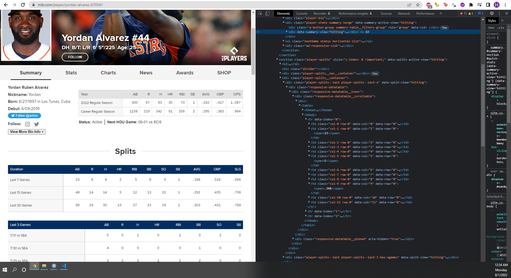
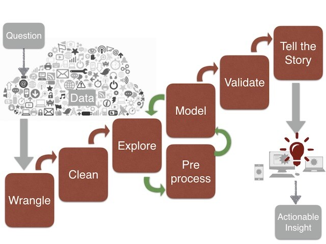
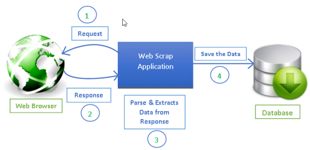
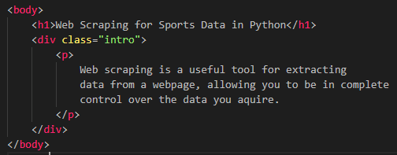
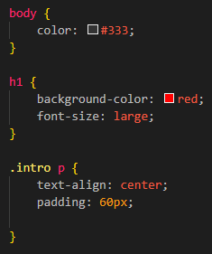

```{r setup, include=FALSE}
knitr::opts_chunk$set(echo = FALSE)
```

## Table of Contents


1. Introduction to Web Scraping (~15 mins)

    - What is Web Scraping?
    - Data Science Pipeline
      - Where does Web Scraping fit in the Data Science Pipeline?
    - HTML & CSS
    - How does Web Scraping work?

2. `Requests` and `BeautifulSoup` (~25 mins)

    - Static Web Scraping with `BeautifulSoup`
      - Scraping MLS data

3. `Selenium` and `SQL (sqlite3)` (~5 mins)

    - How to create web scraping bots
    - Storing scraped data in an SQL database
 
4. Legality of Web Scraping (~5 mins)

    - When is it okay to Scrape a website
      - Consequences of scraping a website you are not allowed to scrape
    - Easy ways to know if a website is okay to scrape
      - `/robots.txt`
      - How to read a `robots.txt` file


# Introduction to Web Scraping

## What is Web Scraping?

- A method of extracting data from a webpage
  - Data is stored in HTML

<center>

{width=75%}

</center>
<br>

- Notice that all visible information can be located somewhere in the HTML document


## Data Science Pipeline

<center>

{width=45%}
</center>

## Where does Web Scraping fit in the Data Science Pipeline?

- Web Scraping is intended for the second step of gathering the data
- Allows you to choose your own data source
    - More relevant data

- Not limited to pre-made datasets

- Automate extraction process
    - Reduces a lot of manual work

- Accurate data collection and easy to implement.

- Data is Everywhere
  - We can make out own datasets.
  
## How does Web Scraping Work?
- There are 4 main steps:
1) Find a data source (a webpage)
2) Get the HTML of the webpage
3) Parse through the HTML and locate where specific data is
  - CSS Selectors
4) Store your data

<center>

{width=75%}

</center>

## HTML & CSS

- HTML tells the web browser how to display media/data onto a webpage.
- CSS specifies the visual layout and aesthetics of a webpage.


<center>

{width=58%}


</center>

# `Requests` and `BeautifulSoup`

## `Requests`

<center>

{width=15%}

</center>

- The `requests` library is used to make HTTP GET requests in Python.
  - Can be used to get the HTML document/content of a webpage.

## `BeautifulSoup`

<center>

{width=30%}

</center>

- The `BeautifulSoup` library is used to parse through HTML documents by taking in CSS Selectors.
  - Can locate specific parts of a webpage (useful for extracting data).
  
## `Pandas`

<center>

{width=30%}

</center>

- The `pandas` library is used to store data into a file (.csv, .xlx, etc.).


# `Selenium` and `SQL (sqlite3)`

## `Selenium`

- `Selenium` is used to interact with webpages via creating bots.
  - Uses a chrome executable/driver to interact with a webpage.

<center>

{width=30%}

</center>

## `SQL (sqlite3)`

- SQL (Structured Query Language).
  - A lot of data is stored in databases, SQL allows us to interact with this data.

<center>

{width=30%}

</center>


## Legality of Web Scraping

- Scraping publicly available data (for the most part) is safe
  - Government sites, or other data without restricted access
  
- Sometimes "public" data is not legal to web scrape
  - [Intel Corp. v. Hamidi](https://en.wikipedia.org/wiki/Intel_Corp._v._Hamidi)
  - [Meta Files Two Lawsuits Over Illicit Data Scraping from Facebook and Instagram](https://www.spiceworks.com/tech/tech-general/news/meta-sues-for-data-scraping/)
  - [Supreme Court Grants Certiorari in Web Scraping Case hiQ v. LinkedIn](https://www.lowenstein.com/news-insights/publications/client-alerts/supreme-court-grants-certiorari-in-web-scraping-case-hiq-v-linkedin-tech-groupwhite-collar)

- What is a easy way to tell if you can or cannot scrape a certain website?
  - `/robots.txt` file
  
  
[https://www.nfl.com/robots.txt](https://www.nfl.com/robots.txt)
<br>
[https://www.spotrac.com/robots.txt](https://www.spotrac.com/robots.txt)
<br>
[https://www.linkedin.com/robots.txt](https://www.linkedin.com/robots.txt)
<br>
[https://facebook.com/robots.txt](https://facebook.com/robots.txt)

## Resources

- How to Read robots.txt: https://www.seerinteractive.com/blog/how-to-read-robots-txt/#crawl-delay
<br>
- BeautifulSoup: https://realpython.com/beautiful-soup-web-scraper-python/
<br>
- BeautifulSoup Docs: https://beautiful-soup-4.readthedocs.io/en/latest/
<br>
- More Deatials on Web Scraping: https://www.scrapingbee.com/blog/web-scraping-101-with-python/
<br>
- Selenium: https://selenium-python.readthedocs.io/


