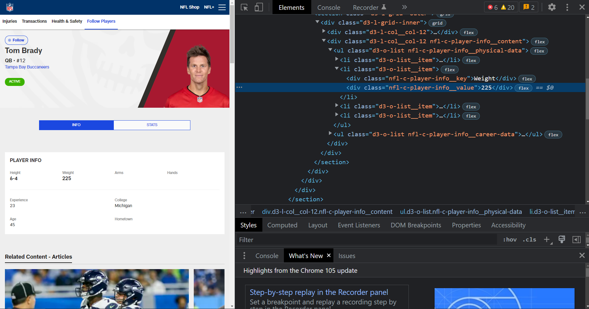

```{r setup, include=FALSE}
knitr::opts_chunk$set(echo = FALSE)
```

## Table of Contents


1. Introduction to Web Scraping

    - What is Web Scraping?
    - Data Science Pipeline
      - Where does Web Scraping fit in the Data Science Pipeline?

2. `Requests` and `BeautifulSoup`

    - How does Web Scraping work?
    - Static Web Scraping with `BeautifulSoup`
      - Scraping MLS data

3. `Selenium` and SQL (sqlite3)

    - How to create web scraping bots
    - Storing scraped data in an SQL database
 
4. Legality of Web Scraping

    - When is it okay to Scrape a website
      - Consequences of scraping a website you are not allowed to scrape
    - Easy ways to know if a website is okay to scrape
      - `/robots.txt`
      - How to read a `robots.txt` file


# Introduction to Web Scraping

## What is Web Scraping?

- A method of extracting data from a webpage
  - Data is stored in HTML

<center>

{width=75%}

</center>
<br>

- Notice that all visible information can be located somewhere in the HTML document
    - Web scraping takes advantage if this by located this information ina  webpage

## Data Science Pipeline

<center>

{width=45%}
</center>

- Where does Web Scraping fit in the Data Science Pipeline?
    - Built in Data sets
      - Sci-kit Learn
      - R packages
    - Data sets Online
      - Kaggle
      - Government sites

- Data is Everywhere
  - We can make out own datasets

## `Requests` and `BeautifulSoup`

<center>

{width=15%}

</center>

- The `requests` library is used to make HTTP requests in Python
  - Can be used to get the HTML document/content of a webpage

<center>

{width=30%}

</center>

- The `BeautifulSoup` library is used to parse through HTML documents
  - Can locate specific parts of a webpage (useful for extracting data)
  
## Web Scraping Pipeline

1. Use the `requests` library to make an HTTP GET request
    - This GET request will return the HTML content of a webpage
    
2. Parse through the HTML and extract specific data with the `BeautifulSoup` package
    - Use CSS Selectors for identifying and extract these specific parts of the HTML document

3. Store the data
    - We will be using the `pandas` package in this presentation

<center>

{width=75%}

</center>

**DEMO**

## `Selenium` and SQL (sqlite3)

- `Selenium` is used to interact with webpages via creating bots
- Allows use to dymanically scrape data

<center>

{width=30%}

</center>

- SQL (Structured Query Language)
  - A lot of data is stored in databases, SQL allows us to interact with this data

<center>

{width=30%}

</center>

**DEMO**

## Legality of Web Scraping

- Scraping publicly available data (for the most part) is safe
  - Government sites, or other data without restricted access
  
- Sometimes "public" data is not legal to web scrape
  - [Intel Corp. v. Hamidi](https://en.wikipedia.org/wiki/Intel_Corp._v._Hamidi)
  - [Meta Files Two Lawsuits Over Illicit Data Scraping from Facebook and Instagram](https://www.spiceworks.com/tech/tech-general/news/meta-sues-for-data-scraping/)
  - [Supreme Court Grants Certiorari in Web Scraping Case hiQ v. LinkedIn](https://www.lowenstein.com/news-insights/publications/client-alerts/supreme-court-grants-certiorari-in-web-scraping-case-hiq-v-linkedin-tech-groupwhite-collar)

- What is a easy way to tell if you can or cannot scrape a certain website
  - `/robots.txt` file
  
  
[https://www.nfl.com/robots.txt](https://www.nfl.com/robots.txt)
<br>
[https://www.spotrac.com/robots.txt](https://www.spotrac.com/robots.txt)
<br>
[https://www.linkedin.com/robots.txt](https://www.linkedin.com/robots.txt)
<br>
[https://facebook.com/robots.txt](https://facebook.com/robots.txt)

  
**DEMO**


